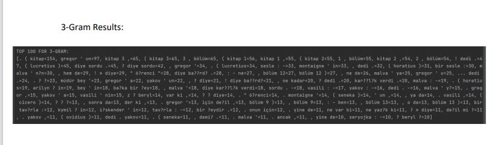
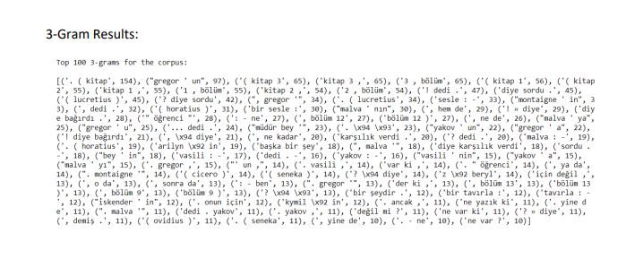

# ngram-java-python
Finding ngrams of given txt files (merging all) and showing the results. Implemented both in Java and Python and their runtime is compared.

- Using the txt files in CorpusFiles folder

Java:

Python:

